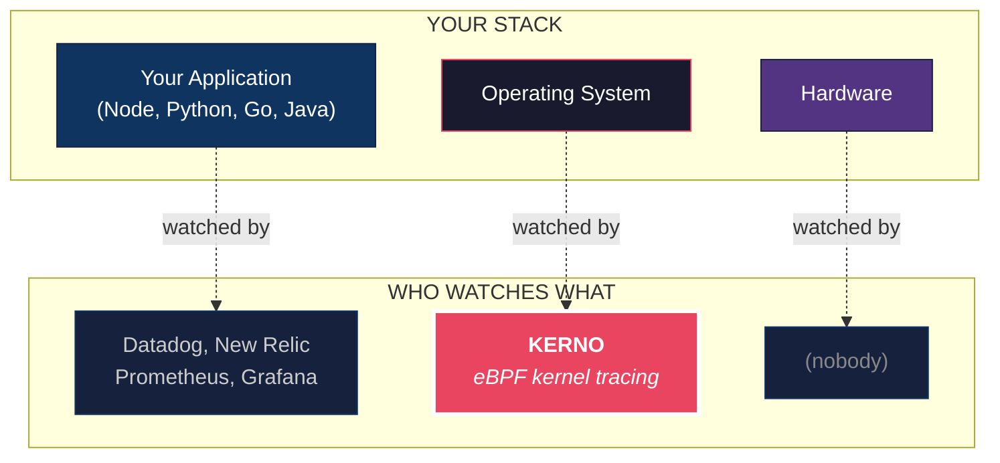
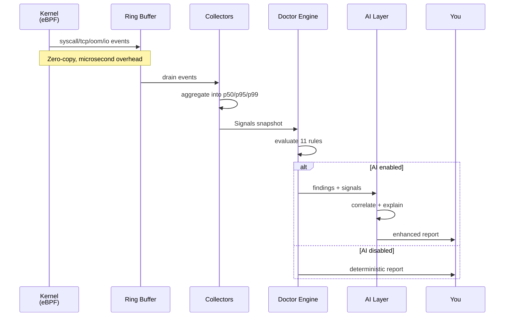
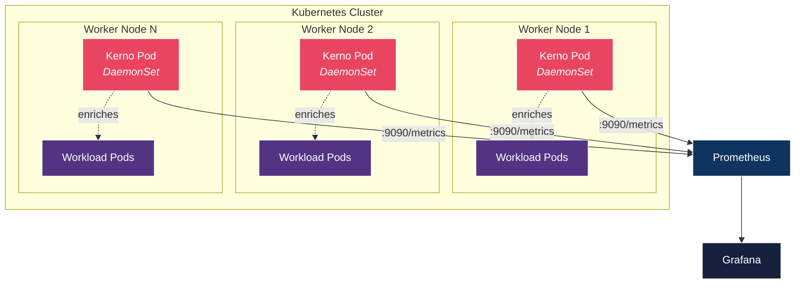

<div align="center">

# KERNO

### Production broke? One command. Root cause. 30 seconds.

**eBPF-powered incident diagnosis for Kubernetes & Linux - in plain English. No PhD required.**

[](https://github.com/lowplane/kerno/actions/workflows/ci.yml)
[](https://goreportcard.com/report/github.com/lowplane/kerno)
[](LICENSE)
[](https://github.com/lowplane/kerno/releases)


[**Quick Start**](#quick-start) · [**How It Works**](#how-it-works) · [**Features**](#features) · [**Kubernetes**](#kubernetes-deployment) · [**Docs**](docs/architecture.md)

</div>

---

## What is Kerno?

Imagine your Linux server is feeling sick. Something is slow, something is breaking, but you don't know what. You check CPU - looks fine. Memory - fine. Your dashboards are green. But users are complaining.

**That's because your dashboards live at the application layer. The real problem is happening deep inside the kernel - and nothing is looking there.**

Kerno looks there.

It watches the Linux kernel in real time using eBPF - the same technology Netflix and Meta use to diagnose their servers - and tells you exactly what's wrong in plain English. No PhD required.

```bash
sudo kerno doctor
```

That's it. One command. 30 seconds later, you get a diagnostic report that reads like a doctor's note:

```
╔═══════════════════════════════════════════════════════════╗
║                     KERNO DOCTOR                          ║
║          Kernel Diagnostic Report                         ║
╚═══════════════════════════════════════════════════════════╝

Host:     prod-db-01
Kernel:   6.8.0-generic

────────────────────────────────────────────────────────────
 FINDINGS  (2 critical · 1 warning · 0 info)
────────────────────────────────────────────────────────────

 !!  CRITICAL  TCP Retransmit Storm
     ──────────────────────────────
     Signal:   retransmit rate=12.3% (threshold: 2.0%), 847 retransmits
     Cause:    Network path degradation causing excessive retransmissions
     Impact:   Every connection risks latency spikes
     Fix:      ethtool -S eth0 | grep -i error
               ping -c 100 <gateway>

 !!  CRITICAL  Disk I/O Bottleneck Detected
     ─────────────────────────────────────
     Signal:   sync P99=280ms (threshold: 200ms), 3,241 sync ops
     Cause:    Storage device is saturated - fsync operations blocking
     Impact:   Database writes and file syncs are delayed
     Fix:      iostat -x 1 5
               Consider faster storage or write batching

 !   WARNING   CPU Scheduler Contention
     ──────────────────────────────────
     Signal:   runqueue P99=18ms (warning: 5ms)
     Cause:    Processes waiting in the CPU run queue
     Fix:      top -H
               Reduce worker threads or increase CPU count

────────────────────────────────────────────────────────────
 RECOMMENDED ACTION ORDER
────────────────────────────────────────────────────────────

  1. [NOW]     TCP Retransmit Storm
  2. [NOW]     Disk I/O Bottleneck Detected
  3. [5 MIN]   CPU Scheduler Contention

════════════════════════════════════════════════════════════
```

---

## Why Kerno Exists

> **The kernel knows before anyone else.** When disk gets slow, when the network starts dropping packets, when memory is about to run out - the kernel sees it first. Minutes before your dashboards. Hours before your users.

Every observability tool you already use watches your *application*. Kerno watches the *kernel* - the layer underneath everything.



### How Kerno compares

| | Watches | K8s Required | SLO Mapping | AI Analysis | Install Time |
|---|:---:|:---:|:---:|:---:|:---:|
| Prometheus | Application | No | No | No | Hours |
| Datadog APM | Application | No | Partial | Yes | Hours |
| Inspektor Gadget | Container | **Yes** | No | No | Minutes |
| **Kerno** | **Kernel** | **No** | **Yes** | **Yes** | **30 seconds** |

---

## Features

<table>
<tr>
<td width="50%" valign="top">

### Diagnostics

- **`kerno doctor`** - 30-second full diagnostic with ranked findings and fix suggestions
- **`kerno explain`** - AI-powered kernel error explanation (no root needed)
- **`kerno predict`** - Predict failures before they happen via trend analysis

### Real-Time Tracing

- **`kerno trace syscall`** - Per-process syscall latency streaming
- **`kerno trace disk`** - Block I/O latency by device, operation, process
- **`kerno trace sched`** - CPU scheduler run queue delays

</td>
<td width="50%" valign="top">

### Continuous Monitoring

- **`kerno watch tcp`** - TCP connections, RTT, retransmits
- **`kerno watch oom`** - OOM kill alerts with full context
- **`kerno watch fd`** - FD leak detection via growth rate
- **`kerno start`** - Daemon mode with Prometheus metrics

### Integrations

- **Prometheus** - 16 metrics at `/metrics`
- **Kubernetes** - Helm chart + pod enrichment
- **AI Providers** - Anthropic, OpenAI, Ollama (optional)
- **Systemd** - Unit/slice enrichment on bare metal

</td>
</tr>
</table>

---

## Quick Start

### Prerequisites

- Linux kernel **>= 5.8** with BTF support (check: `ls /sys/kernel/btf/vmlinux`)
- Root access (or `CAP_BPF` + `CAP_PERFMON`)

### One-liner install (any Linux)

```bash
curl -sfL https://raw.githubusercontent.com/lowplane/kerno/main/scripts/install.sh | sudo bash
sudo kerno doctor
```

### Or run as a daemon (bare metal / VMs)

```bash
curl -sfL https://raw.githubusercontent.com/lowplane/kerno/main/scripts/install.sh | sudo bash -s -- --daemon
# Kerno is now running as a systemd service with Prometheus metrics on :9090
sudo kerno doctor          # One-shot diagnosis
journalctl -u kerno -f     # Stream logs
curl localhost:9090/metrics # Scrape with Prometheus
```

### Or deploy on Kubernetes

```bash
helm install kerno ./deploy/helm/kerno \
  -n kerno-system --create-namespace
```

### Or build from source

```bash
git clone https://github.com/lowplane/kerno.git
cd kerno && make build
sudo ./bin/kerno doctor
```

### Or run it in Docker

```bash
docker run --privileged --pid=host \
  -v /sys/kernel/debug:/sys/kernel/debug:ro \
  -v /sys/fs/bpf:/sys/fs/bpf \
  -v /proc:/proc:ro \
  ghcr.io/lowplane/kerno:latest doctor
```

---

## How It Works

Kerno runs as a lightweight agent. When you run `kerno doctor`, it loads six tiny eBPF programs into the kernel, collects 30 seconds of real data, runs it through 11 diagnostic rules, and gives you a ranked report. No sampling. No guesswork. Actual kernel data.

### The Architecture


### The Data Flow



---

## The Diagnostic Rules

Kerno runs 11 deterministic rules against every snapshot. Every rule is explainable, configurable, and tested.

| # | Rule | Triggers When | Severity |
|---|------|---------------|:---:|
| 1 | Disk I/O Bottleneck | fsync p99 > 50ms or write p99 > 200ms | WARN / CRIT |
| 2 | OOM Kill Occurred | Any OOM event in window | CRIT |
| 3 | TCP Retransmit Storm | Retransmit rate > 2% | CRIT |
| 4 | TCP RTT Degradation | RTT p99 > 10ms | WARN |
| 5 | Scheduler Contention | Runqueue delay p99 > 5ms | WARN / CRIT |
| 6 | FD Leak | FD growth > 10/sec sustained | WARN (with ETA) |
| 7 | Syscall Latency High | Any syscall p99 > 100ms | WARN / CRIT |
| 8 | OOM Imminent | Memory > 90% + positive growth | WARN / CRIT (with ETA) |
| 9 | Syscall Error Rate | Error rate > 1% per syscall | WARN / CRIT |
| 10 | Memory Pressure | RSS usage > 90% | WARN |
| 11 | Network Latency | Connection RTT > 100ms | WARN |

---

## Usage

### Diagnostics - "What's wrong right now?"

```bash
# The golden command: 30-second full diagnostic
sudo kerno doctor

# Quick 10-second check
sudo kerno doctor --duration 10s

# JSON output for CI/CD (exits non-zero on critical findings)
sudo kerno doctor --output json --exit-code

# With AI-powered analysis
export KERNO_AI_API_KEY="sk-..."
sudo kerno doctor --ai

# Explain a kernel error (no root needed)
kerno explain "BUG: kernel NULL pointer dereference"
dmesg | tail -5 | kerno explain

# Predict failures before they happen
sudo kerno predict --snapshots 5 --interval 15s
```

### Real-Time Tracing - "Watch it happen"

```bash
# Stream every syscall event
sudo kerno trace syscall

# Only syscalls from PID 1234
sudo kerno trace syscall --pid 1234

# Only read() syscalls, as JSON
sudo kerno trace syscall --filter read --output json

# Top 10 syscalls by p99 latency (updates every second)
sudo kerno trace syscall --top 10

# Disk I/O for postgres, writes over 5ms only
sudo kerno trace disk --process postgres --op write --threshold 5ms

# Scheduler delays > 10ms
sudo kerno trace sched --threshold 10ms
```

### Continuous Monitoring - "Let me know when..."

```bash
# Watch TCP for any connections with retransmits
sudo kerno watch tcp --retransmits

# Alert on any OOM kill
sudo kerno watch oom --alert

# Detect processes leaking FDs
sudo kerno watch fd --threshold 10

# Run as a daemon (Prometheus metrics on :9090)
sudo kerno start
```

---

## Prometheus Metrics

When you run `sudo kerno start`, Kerno exposes 16 Prometheus metrics at `:9090/metrics` - scrape it with Prometheus, visualize in Grafana, alert via Alertmanager.

<details>
<summary><b>View all 16 metrics</b></summary>

| Metric | Type | What It Measures |
|---|:---:|---|
| `kerno_syscall_duration_nanoseconds` | Summary | Syscall latency (p50, p95, p99) |
| `kerno_syscall_total` | Counter | Total syscall events |
| `kerno_tcp_rtt_nanoseconds` | Summary | TCP round-trip time |
| `kerno_tcp_retransmits_total` | Counter | TCP retransmissions |
| `kerno_tcp_connections_total` | Counter | TCP connection events |
| `kerno_oom_kills_total` | Counter | OOM kill events |
| `kerno_disk_io_duration_nanoseconds` | Summary | Disk I/O latency |
| `kerno_disk_io_bytes_total` | Counter | Disk I/O bytes |
| `kerno_sched_delay_nanoseconds` | Summary | CPU run queue delay |
| `kerno_fd_open_total` | Counter | FD open operations |
| `kerno_fd_close_total` | Counter | FD close operations |
| `kerno_collector_events_total` | Counter | Events per collector |
| `kerno_collector_errors_total` | Counter | Errors per collector |
| `kerno_bpf_programs_loaded` | Gauge | Loaded eBPF programs |
| `kerno_info` | Gauge | Build version |

Health endpoints: `/healthz` and `/readyz` return JSON status.

</details>

---

## Kubernetes Deployment

Kerno auto-detects Kubernetes and enriches every event with pod, namespace, node, and deployment labels - no client-go dependency, no heavyweight informers.



### Install with Helm

```bash
helm install kerno ./deploy/helm/kerno \
  -n kerno-system --create-namespace
```

### Customize via values.yaml

```yaml
image:
  repository: ghcr.io/lowplane/kerno
  tag: latest

resources:
  requests: { cpu: 100m, memory: 128Mi }
  limits:   { cpu: "1",  memory: 512Mi }

prometheus:
  enabled: true
  port: 9090

# Enable Prometheus Operator ServiceMonitor
serviceMonitor:
  enabled: true
  interval: 15s

# Restrict to specific nodes
nodeSelector:
  monitoring: "true"
```

### Verify the deployment

```bash
kubectl -n kerno-system get ds kerno
kubectl -n kerno-system logs -l app.kubernetes.io/name=kerno
kubectl -n kerno-system port-forward ds/kerno 9090:9090
curl localhost:9090/metrics
```

### Raw manifests

If you don't use Helm, apply the manifests directly:

```bash
kubectl apply -f deploy/k8s/
```

---

## Environment & AI

**Environment auto-detection.** On start, Kerno picks one of three adapters and enriches every event - no configuration required:

- **Kubernetes** (token present) → pod, namespace, node, deployment
- **Systemd** (PID 1 is systemd) → unit, slice, scope
- **Bare metal** → hostname, cgroup path

**AI (optional).** The AI layer runs **after** the deterministic rule engine - it enriches findings with cross-signal correlation and root cause explanations, never replaces them. Three providers (**Anthropic**, **OpenAI**, **Ollama** for air-gapped), three privacy modes (`full` / `redacted` / `summary`), TTL cache + token-bucket rate limiting, and graceful fallback to a deterministic template on failure. No LLM SDK dependencies - pure `net/http`.

```bash
export KERNO_AI_API_KEY="sk-..."
export KERNO_AI_PROVIDER="anthropic"   # or openai, ollama
sudo kerno doctor --ai
```

---

## Configuration

Kerno works with **zero configuration**. For custom setups, create `/etc/kerno/config.yaml`:

```yaml
log_level: info
log_format: text

collectors:
  syscall_latency: true
  tcp_monitor: true
  oom_track: true
  disk_io: true
  sched_delay: true
  fd_track: true

doctor:
  duration: 30s
  thresholds:
    syscall_p99_warning_ns:  100000000   # 100ms
    syscall_p99_critical_ns: 500000000   # 500ms
    tcp_retransmit_pct:      2.0         # 2%
    oom_memory_pct:          90.0        # 90%
    disk_p99_warning_ns:     50000000    # 50ms
    disk_p99_critical_ns:    200000000   # 200ms
    sched_delay_warning_ns:  5000000     # 5ms
    sched_delay_critical_ns: 20000000    # 20ms
    fd_growth_per_sec:       10.0

prometheus:
  enabled: true
  addr: ":9090"

ai:
  enabled: false
  provider: anthropic
  privacy_mode: summary
```

**Precedence:** CLI flags > environment variables (`KERNO_*`) > config file > defaults.

---

## Building from Source

```bash
# Requirements: Go 1.25+
# Optional for real eBPF: clang 14+, libbpf-dev, llvm

make build          # Build binary (uses BPF stubs - no clang needed)
make bpf            # Compile eBPF C programs
make test           # Run unit tests
make test-race      # Run with race detector
make lint           # golangci-lint
make check          # Full CI check: vet + test + lint
make docker         # Build Docker image
```

---

## Contributing

Contributions welcome. See [CONTRIBUTING.md](CONTRIBUTING.md) for:

- Development setup and prerequisites
- Commit message conventions (Conventional Commits)
- Code review process
- DCO sign-off requirement

For security reports, see [SECURITY.md](SECURITY.md).

---

## License

Apache License 2.0 - see [LICENSE](LICENSE).

<div align="center">

---

**Kerno** is built by [Shivam](https://github.com/btwshivam) at [Lowplane](https://github.com/lowplane).

If Kerno saved your Sunday, consider leaving a **star** - it helps other engineers find the project.

</div>
