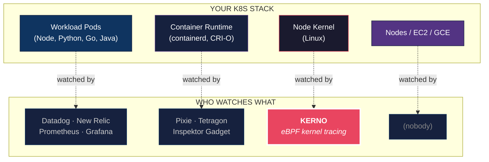
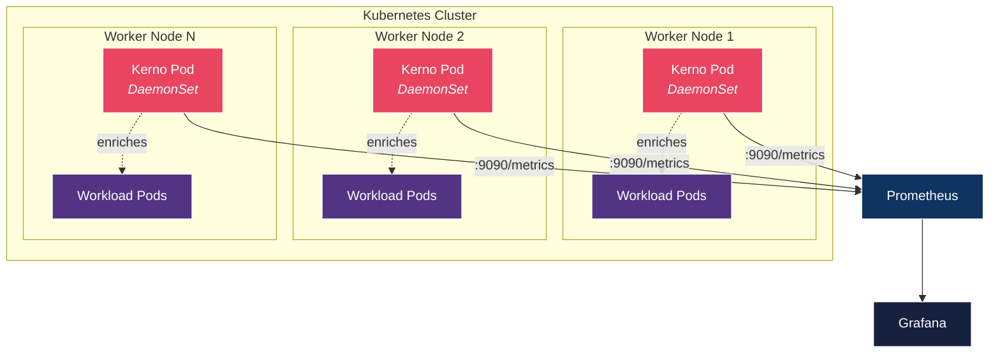
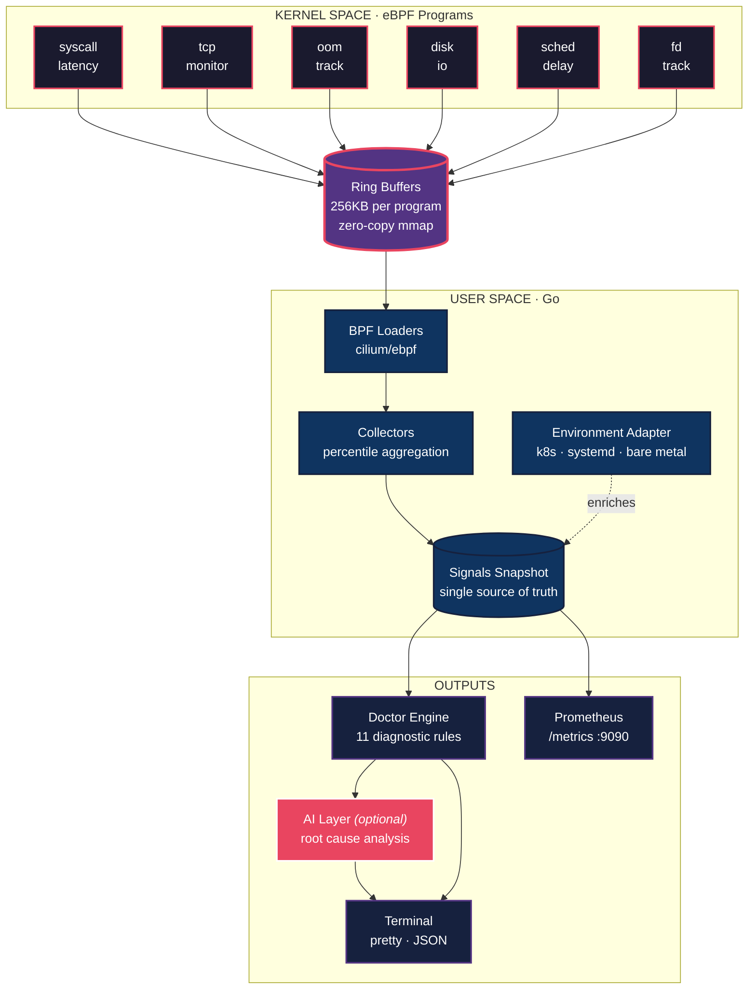
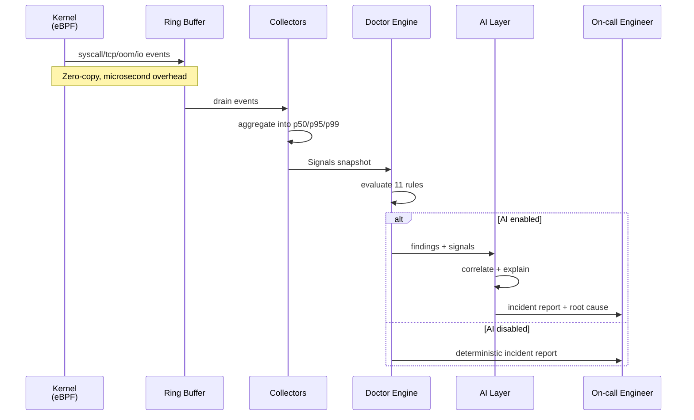

<div align="center">

# KERNO

### `kerno doctor` — the one-command kernel diagnostic

**Your cluster broke. Your dashboards are green. Users are paging.**
**Run `kerno doctor`. 30 seconds. Root cause. Plain English.**

[](https://github.com/optiqor/kerno/actions/workflows/ci.yml)
[](https://goreportcard.com/report/github.com/optiqor/kerno)
[](LICENSE)
[](https://github.com/optiqor/kerno/releases)
[](https://github.com/optiqor/kerno/pkgs/container/kerno)


[**Quick Start**](#quick-start) · [**How It Works**](#how-it-works) · [**Features**](#features) · [**Kubernetes**](#kubernetes-deployment) · [**Docs**](docs/architecture.md)


</div>

---

## The MVP: `kerno doctor`

Every other observability tool watches your application. **Kerno asks the kernel.**
When something breaks in production, the kernel knew minutes before your dashboards. Hours before your users.

```bash
sudo kerno doctor
```

That single command runs for 30 seconds, collects eBPF signals across **6 dimensions** simultaneously (syscalls, TCP, OOM, disk I/O, scheduler, FDs), correlates them, and prints a ranked diagnostic report with **plain-English causes, evidence, and actionable fixes** - no setup, no config, no dashboards.

**Free. Open source. Kubernetes-native. Works on bare metal too.**

## Why Kerno?

It's 3am. PagerDuty fires. Latency is up, error budget is burning, and every dashboard you own is **green**.

- Prometheus says CPU and memory look fine.
- Datadog APM says your app is healthy.
- The Grafana panels your SRE spent a weekend building - all green.

**That's because every tool you have watches your _application_. Nothing is watching the kernel.**



The kernel is where the pain actually lives - disk throttling, TCP retransmits, OOM kills, scheduler contention, FD leaks. The kernel knows minutes before your dashboards. Hours before your users.

Kerno runs as a DaemonSet on every node, streams kernel signals through eBPF with microsecond overhead, and turns them into a diagnostic report that reads like a doctor's note.

```bash
kubectl -n kerno-system exec ds/kerno -- kerno doctor
```

One command. 30 seconds later, you get the report shown in the [demo above](#kerno) — ranked findings, plain-English causes, evidence, and copy-paste fix steps.

That's the entire debugging loop — from page to root cause — in a single command.

---

## How Kerno compares

| | Watches | K8s-Native | Incident Report | SLO Mapping | AI Analysis | Install Time |
|---|:---:|:---:|:---:|:---:|:---:|:---:|
| Prometheus + Grafana | Application | Partial | No | No | No | Hours |
| Datadog APM | Application | Partial | No | Partial | Yes | Hours |
| Cilium Tetragon | Security | **Yes** | No | No | No | Minutes |
| Inspektor Gadget | Container | **Yes** | No | No | No | Minutes |
| Pixie | Application | **Yes** | No | No | No | Minutes |
| **Kerno** | **Kernel** | **Yes** | **Yes** | **Yes** | **Yes** | **< 1 min** |

Kerno is the only eBPF tool in the Kubernetes ecosystem that produces a ranked, human-readable **incident report** - not a firehose of events, not another dashboard, not a query language to learn.

---

## Quick Start

### Prerequisites

- Kubernetes **1.25+** with nodes running kernel **5.8+** (BTF enabled - all major managed offerings qualify: EKS, GKE, AKS, DOKS, Linode, Civo)
- `kubectl` with cluster-admin (to create the namespace + RBAC)

### Install on Kubernetes (primary)

```bash
# Helm
helm install kerno ./deploy/helm/kerno \
  -n kerno-system --create-namespace

# Or raw manifests
kubectl apply -f deploy/k8s/
```

That's it. Within 30 seconds Kerno is running as a DaemonSet on every node.

### Run an incident report on a live cluster

```bash
# Diagnose the whole cluster - 30 seconds of real kernel data
kubectl -n kerno-system exec ds/kerno -- kerno doctor

# JSON output for on-call runbooks / Slack bots
kubectl -n kerno-system exec ds/kerno -- kerno doctor --output json

# With AI-powered root cause analysis
kubectl -n kerno-system set env ds/kerno KERNO_AI_API_KEY=sk-...
kubectl -n kerno-system exec ds/kerno -- kerno doctor --ai
```

### Continuous metrics (for Prometheus + Alertmanager)

```bash
kubectl -n kerno-system port-forward ds/kerno 9090:9090
curl localhost:9090/metrics
```

ServiceMonitor support is built-in when the Prometheus Operator is installed.

### Bare metal / VMs (secondary)

For standalone Linux servers outside Kubernetes:

```bash
# One-liner install
curl -sfL https://raw.githubusercontent.com/optiqor/kerno/main/scripts/install.sh | sudo bash
sudo kerno doctor

# Pin a specific version: --version v0.1.0
```

Or run as a long-lived systemd service with Prometheus metrics:

```bash
curl -sfL https://raw.githubusercontent.com/optiqor/kerno/main/scripts/install.sh | sudo bash -s -- --daemon
journalctl -u kerno -f
```

### Docker (ad-hoc, any host)

```bash
docker run --rm --privileged --pid=host \
  -v /sys/kernel/debug:/sys/kernel/debug:ro \
  -v /sys/kernel/btf:/sys/kernel/btf:ro \
  -v /sys/fs/bpf:/sys/fs/bpf \
  -v /proc:/proc:ro \
  ghcr.io/optiqor/kerno:v0.1.0 doctor
```

Multi-arch images (`linux/amd64`, `linux/arm64`) published to GHCR on every release.

---

## Kubernetes Deployment

Kerno is designed from day one to run as a Kubernetes DaemonSet. One pod per node, one eBPF agent per kernel, zero API server load.



### Pod enrichment - no API server load

Kerno tags every finding with pod, namespace, node, and workload labels. No `client-go` informers, no watch connections - Kerno reads `/var/lib/kubelet/pods` directly, so even a failing API server doesn't blind the agent. Exactly when you need it most.

### Host mounts - the minimum necessary

| Mount | Why |
|---|---|
| `/sys/kernel/debug` | tracepoints, kprobes |
| `/sys/kernel/btf` | CO-RE type resolution |
| `/sys/fs/bpf` | BPF map pinning |
| `/proc` | PID → cgroup → pod resolution |
| `/sys/fs/cgroup` | container resource accounting |
| `/sys/class/net` | per-interface TCP counters |
| `/sys/block` | per-device disk stats |

### Security posture

- Runs with the **minimum capabilities needed** - `CAP_BPF`, `CAP_PERFMON`, `CAP_SYS_PTRACE`, `CAP_NET_ADMIN`, `CAP_DAC_READ_SEARCH` (not `CAP_SYS_ADMIN` for the hot path).
- Read-only root filesystem, `ProtectSystem=strict` via systemd on bare metal.
- No outbound network calls. AI integration is opt-in and goes through your configured provider only.

### Helm values

```yaml
image:
  repository: ghcr.io/optiqor/kerno
  tag: v0.1.0

resources:
  requests: { cpu: 100m, memory: 128Mi }
  limits:   { cpu: "1",  memory: 512Mi }

prometheus:
  enabled: true
  port: 9090

serviceMonitor:     # Prometheus Operator
  enabled: true
  interval: 15s

nodeSelector:
  monitoring: "true"
```

### Verify

```bash
kubectl -n kerno-system get ds kerno
kubectl -n kerno-system logs -l app.kubernetes.io/name=kerno
kubectl -n kerno-system exec ds/kerno -- kerno doctor
```

---

## Features

<table>
<tr>
<td width="50%" valign="top">

### Incident Diagnosis

- **`kerno doctor`** - 30-second cluster-wide diagnostic, ranked findings, fix suggestions
- **`kerno explain`** - AI-powered kernel error explanation (no root needed)
- **`kerno predict`** - surface failures before they page you

### Real-Time Tracing

- **`kerno trace syscall`** - per-pod syscall latency streaming
- **`kerno trace disk`** - block I/O latency by device, op, process
- **`kerno trace sched`** - CPU scheduler run queue delays

</td>
<td width="50%" valign="top">

### Continuous Monitoring

- **`kerno watch tcp`** - TCP connections, RTT, retransmits
- **`kerno watch oom`** - OOM kill alerts with pod context
- **`kerno watch fd`** - FD leak detection via growth rate
- **`kerno start`** - daemon mode with Prometheus metrics

### Integrations

- **Prometheus** - 16 metrics at `/metrics`, ServiceMonitor support
- **Kubernetes** - Helm chart + pod enrichment (no API server load)
- **AI Providers** - Anthropic, OpenAI, Ollama (optional, opt-in)
- **Systemd** - unit/slice enrichment on bare metal

</td>
</tr>
</table>

---

## How It Works

Kerno runs as a lightweight Go agent with six tiny eBPF programs attached to stable tracepoints. When `kerno doctor` runs, it collects 30 seconds of real kernel data, evaluates 11 diagnostic rules deterministically, and emits a ranked incident report. No sampling. No guesswork. No query language.

### Architecture



### Core principles

1. **Deterministic first.** The rule engine is pure Go, testable, and runs whether AI is on or off. Every finding has a clear cause, threshold, and fix.
2. **Zero-copy hot path.** Kernel events land in eBPF ring buffers and are drained via `mmap` - microsecond overhead, no serialization cost.
3. **No API server load.** Pod enrichment reads the kubelet's local pod manifests. The agent survives API server outages - the moment you need it most.
4. **AI is a post-processor.** Optional. Opt-in. Never touches the hot path. The deterministic engine always runs; AI enriches, it never replaces.
5. **Graceful degradation.** If an eBPF program fails to load on a weird kernel, that collector is skipped with a clear warning. The rest keep working.

### Data flow



---

## The Diagnostic Rules

Kerno runs 11 deterministic rules against every snapshot. Every rule is explainable, configurable, and covered by tests.

| # | Rule | Triggers When | Severity |
|---|------|---------------|:---:|
| 1 | Disk I/O Bottleneck | fsync p99 > 50ms or write p99 > 200ms | WARN / CRIT |
| 2 | OOM Kill Occurred | Any OOM event in window | CRIT |
| 3 | TCP Retransmit Storm | Retransmit rate > 2% | CRIT |
| 4 | TCP RTT Degradation | RTT p99 > 10ms | WARN |
| 5 | Scheduler Contention | Runqueue delay p99 > 5ms | WARN / CRIT |
| 6 | FD Leak | FD growth > 10/sec sustained | WARN (with ETA) |
| 7 | Syscall Latency High | Any syscall p99 > 100ms | WARN / CRIT |
| 8 | OOM Imminent | Memory > 90% + positive growth | WARN / CRIT (with ETA) |
| 9 | Syscall Error Rate | Error rate > 1% per syscall | WARN / CRIT |
| 10 | Memory Pressure | RSS usage > 90% | WARN |
| 11 | Network Latency | Connection RTT > 100ms | WARN |

---

## Usage

### Incident diagnosis - "what broke just now?"

```bash
# The golden command
kubectl -n kerno-system exec ds/kerno -- kerno doctor

# Quick 10-second check
kubectl -n kerno-system exec ds/kerno -- kerno doctor --duration 10s

# JSON for CI/CD, runbooks, Slack bots (non-zero exit on critical)
kubectl -n kerno-system exec ds/kerno -- kerno doctor --output json --exit-code

# AI-powered root cause analysis
kubectl -n kerno-system exec ds/kerno -- kerno doctor --ai

# Explain a kernel error (no root, no cluster needed)
kerno explain "BUG: kernel NULL pointer dereference"
dmesg | tail -5 | kerno explain

# Predict failures before they page you
kubectl -n kerno-system exec ds/kerno -- kerno predict --snapshots 5 --interval 15s
```

### Real-time tracing - "watch it happen"

```bash
# Every syscall event streaming
kubectl -n kerno-system exec ds/kerno -- kerno trace syscall

# Only syscalls from a specific pod's PID
kubectl -n kerno-system exec ds/kerno -- kerno trace syscall --pid 1234

# Postgres disk writes over 5ms
kubectl -n kerno-system exec ds/kerno -- kerno trace disk --process postgres --op write --threshold 5ms

# Scheduler delays over 10ms
kubectl -n kerno-system exec ds/kerno -- kerno trace sched --threshold 10ms
```

### Continuous monitoring - "alert me when…"

```bash
# TCP connections with retransmits
kubectl -n kerno-system exec ds/kerno -- kerno watch tcp --retransmits

# Any OOM kill, with pod context
kubectl -n kerno-system exec ds/kerno -- kerno watch oom --alert

# Processes leaking FDs
kubectl -n kerno-system exec ds/kerno -- kerno watch fd --threshold 10
```

---

## Prometheus Metrics

The DaemonSet exposes 16 metrics at `:9090/metrics`. ServiceMonitor is included when the Prometheus Operator is installed.

<details>
<summary><b>View all 16 metrics</b></summary>

| Metric | Type | What It Measures |
|---|:---:|---|
| `kerno_syscall_duration_nanoseconds` | Summary | Syscall latency (p50, p95, p99) |
| `kerno_syscall_total` | Counter | Total syscall events |
| `kerno_tcp_rtt_nanoseconds` | Summary | TCP round-trip time |
| `kerno_tcp_retransmits_total` | Counter | TCP retransmissions |
| `kerno_tcp_connections_total` | Counter | TCP connection events |
| `kerno_oom_kills_total` | Counter | OOM kill events |
| `kerno_disk_io_duration_nanoseconds` | Summary | Disk I/O latency |
| `kerno_disk_io_bytes_total` | Counter | Disk I/O bytes |
| `kerno_sched_delay_nanoseconds` | Summary | CPU run queue delay |
| `kerno_fd_open_total` | Counter | FD open operations |
| `kerno_fd_close_total` | Counter | FD close operations |
| `kerno_collector_events_total` | Counter | Events per collector |
| `kerno_collector_errors_total` | Counter | Errors per collector |
| `kerno_bpf_programs_loaded` | Gauge | Loaded eBPF programs |
| `kerno_info` | Gauge | Build version |

Health endpoints: `/healthz` and `/readyz` return JSON status.

</details>

---

## Environment & AI

**Environment auto-detection.** Kerno picks one of three adapters and enriches every event - no configuration required:

- **Kubernetes** (in-cluster token present) → pod, namespace, node, deployment
- **Systemd** (PID 1 is systemd) → unit, slice, scope
- **Bare metal** → hostname, cgroup path

**AI (optional).** The AI layer runs **after** the deterministic rule engine - it correlates cross-signals and explains root causes, it never replaces rules. Three providers (**Anthropic**, **OpenAI**, **Ollama** for air-gapped), three privacy modes (`full` / `redacted` / `summary`), TTL cache + token-bucket rate limiting, graceful fallback to a deterministic template on failure. No LLM SDK dependencies - pure `net/http`.

```bash
kubectl -n kerno-system set env ds/kerno \
  KERNO_AI_API_KEY=sk-... \
  KERNO_AI_PROVIDER=anthropic
kubectl -n kerno-system exec ds/kerno -- kerno doctor --ai
```

---

## Configuration

Kerno works with **zero configuration**. For custom setups, mount a `config.yaml` or use `KERNO_*` env vars:

```yaml
log_level: info

collectors:
  syscall_latency: true
  tcp_monitor: true
  oom_track: true
  disk_io: true
  sched_delay: true
  fd_track: true

doctor:
  duration: 30s
  thresholds:
    syscall_p99_warning_ns:  100000000   # 100ms
    syscall_p99_critical_ns: 500000000   # 500ms
    tcp_retransmit_pct:      2.0         # 2%
    oom_memory_pct:          90.0        # 90%
    disk_p99_warning_ns:     50000000    # 50ms
    disk_p99_critical_ns:    200000000   # 200ms
    sched_delay_warning_ns:  5000000     # 5ms
    sched_delay_critical_ns: 20000000    # 20ms
    fd_growth_per_sec:       10.0

prometheus:
  enabled: true
  addr: ":9090"

ai:
  enabled: false
  provider: anthropic
  privacy_mode: summary
```

**Precedence:** CLI flags > environment variables (`KERNO_*`) > config file > defaults.

---

## Roadmap

See [TODO.md](TODO.md) for the full plan. Headlines:

- **v0.1** — DaemonSet, 6 eBPF collectors, 11 rules, Prometheus, AI post-processor, 7 chaos scenarios, 13-phase verify pipeline — **shipped, all gates green on kernel 6.17**
- **v0.2** — CRD for cluster-wide incident policies, OpenTelemetry OTLP export, Grafana dashboards, sliding-window aggregation
- **v0.3** — historical incident replay, SLO-linked alerts, Slack / PagerDuty integrations
- **v1.0** — multi-cluster control plane, managed offering (Optiqor Cloud)

---

## Building from Source

```bash
# Requirements: Go 1.25+
# Optional for real eBPF: clang 14+, libbpf-dev, llvm, bpftool

make build          # Build binary (uses BPF stubs — no clang needed)
make generate       # Run bpf2go to produce *_bpfel.go from C sources
make bpf            # Compile eBPF C programs to .o
make bpf-verify     # Build the standalone kernel-verifier load harness
make test           # Run unit tests
make test-race      # Run with race detector
make lint           # golangci-lint
make check          # vet + test + lint
make verify         # Comprehensive 13-phase production-readiness check
make demo           # Record demo.gif via vhs (needs vhs + ttyd + ffmpeg)
make demo-cast      # Record demo.cast via asciinema (alternative to vhs)
make docker         # Build Docker image
```

**Reproducing the verifier proof end-to-end:**

```bash
# Install eBPF toolchain
sudo apt-get install -y clang llvm libbpf-dev linux-tools-$(uname -r) jq

# Build, generate, verify everything in one shot
make verify         # exits 0 only if all 62 checks pass
```

**Inducing real incidents to demo or test rule firing:**

```bash
sudo tc qdisc add dev lo root netem loss 30%   # optional, for tcp-loss
kerno chaos --induce <scenario> --intensity high --duration 30s

# Available scenarios (kerno chaos --list):
#   cpu        scheduler_contention
#   disk-sat   disk_io_bottleneck
#   fd-leak    fd_leak
#   memory     oom_imminent
#   tcp-churn  scheduler_contention
#   tcp-loss   tcp_retransmit_storm
#   cascade    multiple
```

In another shell, `sudo kerno doctor` will catch the induced incident.

---

## Contributing

Contributions welcome. See [CONTRIBUTING.md](CONTRIBUTING.md) for:

- Development setup and prerequisites
- Commit message conventions (Conventional Commits)
- Code review process
- DCO sign-off requirement

For security reports, see [SECURITY.md](SECURITY.md).

---

## License

Apache License 2.0 - see [LICENSE](LICENSE).

<div align="center">

---

**Kerno** is built by [Shivam](https://github.com/btwshivam) at [Optiqor](https://github.com/optiqor).

If Kerno saved your on-call shift, consider leaving a **star** - it helps other engineers find the project.

</div>
